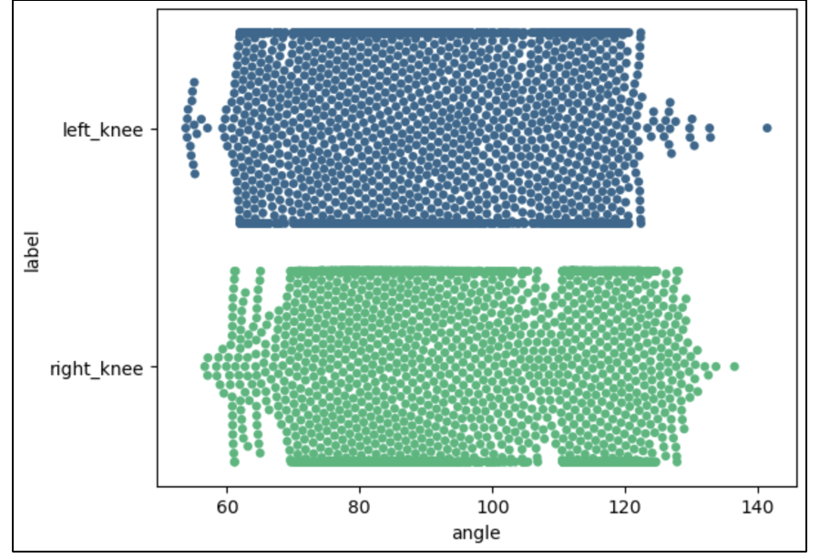

<h2 align="center">BICEP CURL MODEL TRAINING PROCESS</h2>

### 1. Folder structure

```
bicep_model
│   1.stage.data.ipynb - process collected videos for lunge stage
|   2.stage.sklearn.ipynb - train models using Sklearn ML algo for lunge stage
│   3.stage.deep_leaning.ipynb - train models using Deep Learning for lunge stage
│   4.stage.detection.ipynb - detection on test videos for lunge stage
│   5.stage.data.ipynb - process collected videos for lunge stage
|   6.err.sklearn.ipynb - train models using Sklearn ML algo for lunge error
│   7.err.deep_leaning.ipynb - train models using Deep Learning for lunge error
│   8.err.evaluation.ipynb - evaluate trained models for lunge error
│   9.err.detection.ipynb - detection on test videos for lunge error
|   stage.train.csv - train dataset for lunge stage after converted from videos
|   stage.test.csv - test dataset for lunge stage after converted from videos
|   err.train.csv - train dataset for lunge error after converted from videos
|   err.test.csv - test dataset after for lunge error converted from videos
|   evaluation.csv - models' evaluation results
│
└───model/ - folder contains best trained models and input scaler
│   │
```

### 2. Important landmarks

There are 3 popular errors of bicep curl that will be targeted in this thesis:

-   Loose upper arm: when an arm moves upward during the exercise, the upper arm is moving instead of staying still.
-   Weak peak contraction: when an arm moves upward, it does not go high enough therefore not put enough contraction to the bicep.
-   Lean too far back: the performer’s torso leans back and fore during the exercise for momentum.

In my research and exploration, **_the important MediaPipe Pose landmarks_** for this exercise are: nose, left shoulder, right shoulder, right elbow, left elbow, right wrist, left wrist, right hip and left hip.

### 3. Error detection method

1. **Knee angle**: Can be detected by calculating the angle of the left and right knee. To precisely choose the correct lower and upper thresholds for this error, videos of contributors perform correct form of the exercise are analyzed. In conclusion from the graph, the angle of left/right knee during the low position of a lunge should be in between 60 and 135 degrees.

    - Analyzed result:
      <p align="center"></p>

1. **Knee over toe**: Due to its complexity, machine learning will be used for this detection. See this [notebook](./8.err.evaluation.ipynb) for a evaluation process for this models.
