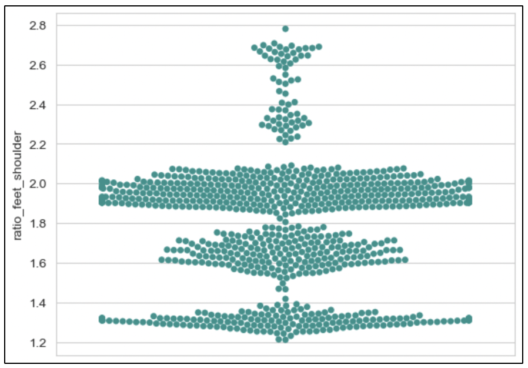

<h2 align="center">BICEP CURL MODEL TRAINING PROCESS</h2>

### 1. Folder structure

```
bicep_model
│   1.counter_model.ipynb - train models using Sklearn ML algo and evaluate the models results
|   2.analyzed_bad_pose.ipynb - analyze feet and knee position in correct squat exercise
│   3.detection.ipynb - detection on test videos
|   train.csv - train dataset after converted from videos
|   test.csv - test dataset after converted from videos
|   evaluation.csv - models' evaluation results
|   analyzed_pose.csv - analyzed feet and knee position dataset
│
└───model/ - folder contains best trained models and input scaler
│   │
```

### 2. Important landmarks

TThere are 3 popular errors of basic squat that will be targeted in this thesis:

-   Feet placement: Feet placement is extremely important in squat. The 2 feet should place in a way that the width of 2 feet is around the width of 2 shoulders.
-   Knee placement: Knee placement is not only important but could be dangerous if perform incorrectly with heavy load. During the “down” stage of the exercise, the knee should be open out to wider than the feet width.

In my research and exploration, **_the important MediaPipe Pose landmarks_** for this exercise are: left shoulder, right shoulder, right hip, left hip, right knee, left knee, right ankle and left ankle.

### 3. Stage detection

In contrast with other exercises, there are 2 stages when performing squat, “up” and “down” stage. Because it is important for error detection to discriminate stage of the squat, a model is trained for this task. See this [notebook](./1.counter_model.ipynb) for a evaluation process for this model.

### 3. Error detection method

1. **Feet placement**: Can be detected by calculate ratio between the distance of 2 feet and the distance of 2 shoulders.

    - Analyzed results:
      <p align="center"></p>

1. **Knee placement**: Can be detected by calculating ratio between the distance of 2 knee and 2 feet. Similar to the previous error, videos of contributors are analyzed to determine a correct threshold. Due to the dynamic movement of the knee during the exercise, the calculated ratio from the data will be separate into 3 stages: up, middle and down.

    - Analyzed result:
          <p align="center"></p>
